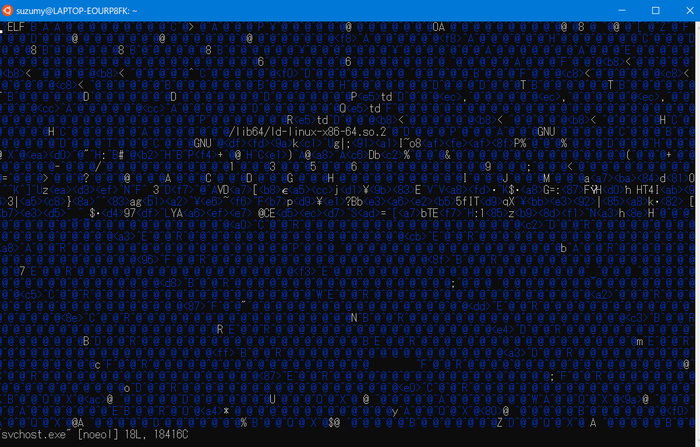
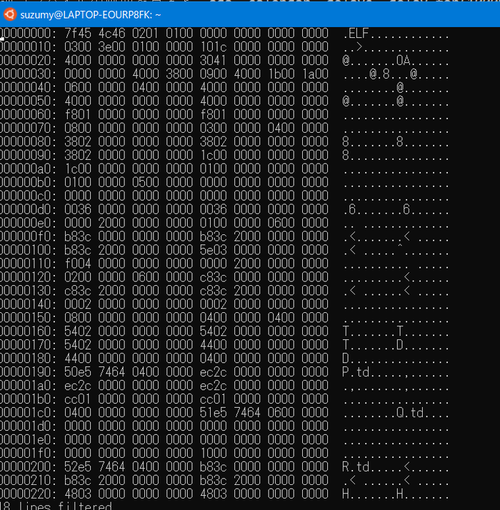
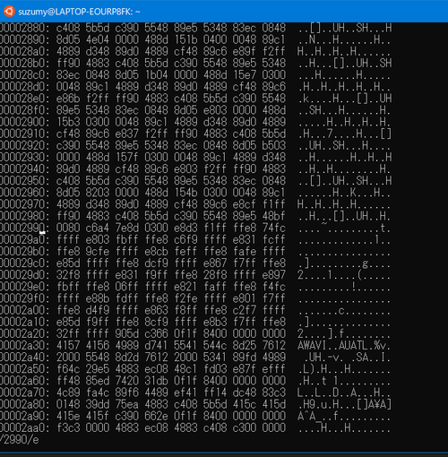
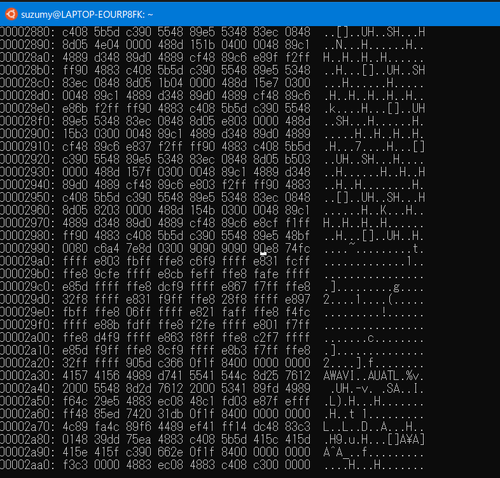

# Hurry up! Wait!
## reversing
## picoCTF2021
***

まず.exeの実行ファイルが渡される。が、拡張子がexeだからと言ってwindowsの実行ファイルであるとは限らないため、まずはfileで調べる。
```
~$ file svchost.exe
svchost.exe: ELF 64-bit LSB shared object, x86-64, version 1 (SYSV), dynamically linked, interpreter /lib64/ld-linux-x86-64.so.2, for GNU/Linux 3.2.0, BuildID[sha1]=dffd9a6bc115677c3b91a1497e6f38affeaf8f50, stripped
```

やはりexeではなくELFファイルだった。linuxで実行できるため実行していく。
```
~$ ./svchost.exe

```

しばらく待っても文字を入力しても何も応答しないため、ctrl+cで終了する。
ヒントを得ようとstraceを動かしてみる。

```
~$ strace ./svchost.exe
execve("./svchost.exe", ["./svchost.exe"], 0x7fffd490b320 /* 20 vars */) = 0
brk(NULL)                               = 0x7ffff3b95000
access("/etc/ld.so.nohwcap", F_OK)      = -1 ENOENT (No such file or directory)
access("/etc/ld.so.preload", R_OK)      = -1 ENOENT (No such file or directory)
openat(AT_FDCWD, "/etc/ld.so.cache", O_RDONLY|O_CLOEXEC) = 3
fstat(3, {st_mode=S_IFREG|0644, st_size=55750, ...}) = 0
mmap(NULL, 55750, PROT_READ, MAP_PRIVATE, 3, 0) = 0x7f9b04339000
close(3)                                = 0
access("/etc/ld.so.nohwcap", F_OK)      = -1 ENOENT (No such file or directory)
openat(AT_FDCWD, "/usr/lib/x86_64-linux-gnu/libgnat-7.so.1", O_RDONLY|O_CLOEXEC) = 3
read(3, "\177ELF\2\1\1\0\0\0\0\0\0\0\0\0\3\0>\0\1\0\0\0\340\245\21\0\0\0\0\0"..., 832) = 832
fstat(3, {st_mode=S_IFREG|0644, st_size=3618264, ...}) = 0
mmap(NULL, 8192, PROT_READ|PROT_WRITE, MAP_PRIVATE|MAP_ANONYMOUS, -1, 0) = 0x7f9b04330000
mmap(NULL, 5769184, PROT_READ|PROT_EXEC, MAP_PRIVATE|MAP_DENYWRITE, 3, 0) = 0x7f9b03a70000
mprotect(0x7f9b03dd3000, 2097152, PROT_NONE) = 0
mmap(0x7f9b03fd3000, 65536, PROT_READ|PROT_WRITE, MAP_PRIVATE|MAP_FIXED|MAP_DENYWRITE, 3, 0x363000) = 0x7f9b03fd3000
mmap(0x7f9b03fe3000, 55264, PROT_READ|PROT_WRITE, MAP_PRIVATE|MAP_FIXED|MAP_ANONYMOUS, -1, 0) = 0x7f9b03fe3000
close(3)                                = 0
access("/etc/ld.so.nohwcap", F_OK)      = -1 ENOENT (No such file or directory)
openat(AT_FDCWD, "/lib/x86_64-linux-gnu/libc.so.6", O_RDONLY|O_CLOEXEC) = 3
read(3, "\177ELF\2\1\1\3\0\0\0\0\0\0\0\0\3\0>\0\1\0\0\0\20\35\2\0\0\0\0\0"..., 832) = 832
fstat(3, {st_mode=S_IFREG|0755, st_size=2030928, ...}) = 0
mmap(NULL, 4131552, PROT_READ|PROT_EXEC, MAP_PRIVATE|MAP_DENYWRITE, 3, 0) = 0x7f9b03670000
mprotect(0x7f9b03857000, 2097152, PROT_NONE) = 0
mmap(0x7f9b03a57000, 24576, PROT_READ|PROT_WRITE, MAP_PRIVATE|MAP_FIXED|MAP_DENYWRITE, 3, 0x1e7000) = 0x7f9b03a57000
mmap(0x7f9b03a5d000, 15072, PROT_READ|PROT_WRITE, MAP_PRIVATE|MAP_FIXED|MAP_ANONYMOUS, -1, 0) = 0x7f9b03a5d000
close(3)                                = 0
access("/etc/ld.so.nohwcap", F_OK)      = -1 ENOENT (No such file or directory)
openat(AT_FDCWD, "/lib/x86_64-linux-gnu/libgcc_s.so.1", O_RDONLY|O_CLOEXEC) = 3
read(3, "\177ELF\2\1\1\0\0\0\0\0\0\0\0\0\3\0>\0\1\0\0\0\300*\0\0\0\0\0\0"..., 832) = 832
fstat(3, {st_mode=S_IFREG|0644, st_size=96616, ...}) = 0
mmap(NULL, 2192432, PROT_READ|PROT_EXEC, MAP_PRIVATE|MAP_DENYWRITE, 3, 0) = 0x7f9b03450000
mprotect(0x7f9b03467000, 2093056, PROT_NONE) = 0
mmap(0x7f9b03666000, 8192, PROT_READ|PROT_WRITE, MAP_PRIVATE|MAP_FIXED|MAP_DENYWRITE, 3, 0x16000) = 0x7f9b03666000
close(3)                                = 0
mmap(NULL, 12288, PROT_READ|PROT_WRITE, MAP_PRIVATE|MAP_ANONYMOUS, -1, 0) = 0x7f9b04320000
arch_prctl(ARCH_SET_FS, 0x7f9b04320740) = 0
mprotect(0x7f9b03a57000, 16384, PROT_READ) = 0
mprotect(0x7f9b03666000, 4096, PROT_READ) = 0
mprotect(0x7f9b03fd3000, 32768, PROT_READ) = 0
mprotect(0x7f9b04603000, 4096, PROT_READ) = 0
mprotect(0x7f9b04229000, 4096, PROT_READ) = 0
munmap(0x7f9b04339000, 55750)           = 0
rt_sigaction(SIGABRT, {sa_handler=0x7f9b03d3ba50, sa_mask=[], sa_flags=SA_RESTORER|SA_RESTART|SA_NODEFER|SA_SIGINFO, sa_restorer=0x7f9b036af040}, NULL, 8) = 0
rt_sigaction(SIGFPE, {sa_handler=0x7f9b03d3ba50, sa_mask=[], sa_flags=SA_RESTORER|SA_RESTART|SA_NODEFER|SA_SIGINFO, sa_restorer=0x7f9b036af040}, NULL, 8) = 0
rt_sigaction(SIGILL, {sa_handler=0x7f9b03d3ba50, sa_mask=[], sa_flags=SA_RESTORER|SA_RESTART|SA_NODEFER|SA_SIGINFO, sa_restorer=0x7f9b036af040}, NULL, 8) = 0
rt_sigaction(SIGBUS, {sa_handler=0x7f9b03d3ba50, sa_mask=[], sa_flags=SA_RESTORER|SA_RESTART|SA_NODEFER|SA_SIGINFO, sa_restorer=0x7f9b036af040}, NULL, 8) = 0
sigaltstack({ss_sp=0x7f9b03fec7e0, ss_flags=0, ss_size=16384}, NULL) = 0
rt_sigaction(SIGSEGV, {sa_handler=0x7f9b03d3ba50, sa_mask=[], sa_flags=SA_RESTORER|SA_ONSTACK|SA_RESTART|SA_NODEFER|SA_SIGINFO, sa_restorer=0x7f9b036af040}, NULL, 8) = 0
fstat(2, {st_mode=S_IFCHR|0660, st_rdev=makedev(4, 4), ...}) = 0
fstat(0, {st_mode=S_IFCHR|0660, st_rdev=makedev(4, 4), ...}) = 0
fstat(1, {st_mode=S_IFCHR|0660, st_rdev=makedev(4, 4), ...}) = 0
gettimeofday({tv_sec=1634784352, tv_usec=758878}, NULL) = 0
nanosleep({tv_sec=1000000, tv_nsec=0},

```

当然途中で止まっているが、最後の行に
> nanosleep({tv_sec=1000000, tv_nsec=0},

とあるのが見える。命令の具体的な意味は不明だが、sleepということはなんらかの無限ループが発生しているっぽい。tv_sec=1000000ということは1000000秒ということだろうと考えられる。
だとしたら実行後反応がないことにも納得がいく。

もう少しヒントが欲しいため、ltraceを実行してみる。
```
~$ ltrace ./svchost.exe
__gnat_initialize(0x7fffea1fd328, 0x7fffea1fd418, 0x7fffea1fd428, 0x7f267da02a30) = 0x7fffea1fd328
__gnat_runtime_initialize(1, 0x7fffea1fd418, 0x7fffea1fd428, 0x7f267da02a30) = 0
system__soft_links___elabs(11, 0x7fffea1fd0d0, 0, 0)                      = 0x7f267d5ec2a0
system__exception_table___elabb(11, 0x7fffea1fd0d0, 0, 0)                 = 3
system__exceptions___elabs(0x7f267d35dcaf, 0x7fffffff, 0x7f267d5e29a0, 0x7f267d5e8da0) = 0x7f267d2ffdc0
system__soft_links___elabb(0x7f267d35837f, 0x7fffffff, 0x7f267d5e23a0, 0x7f267d5e8da0) = 0x7f267d5ec000
system__secondary_stack___elabb(0x7f267d35837f, 0x7fffffff, 0x7f267d5e23a0, 0x7f267d5e8da0) = 0x7f267d5ec000
ada__io_exceptions___elabs(0x7f267d5ebec0, 0x7fffffff, 0x2800, 0x7f267d5e8da0) = 0x7f267d2ffdc0
interfaces__c___elabs(0x7f267d3401ff, 0x7fffffff, 0x7f267d5e0a00, 0x7f267d5e8da0) = 0x7f267d2ffdc0
system__os_lib___elabb(0x7f267d35664f, 0x7fffffff, 0x7f267d5e2960, 0x7f267d5e8da0) = 0x7f267d5e9500
ada__tags___elabs(0x7f267d35664f, 0x7fffffff, 0x7f267d5e2960, 0x7f267d5e8da0) = 0x7f267d2ffdc0
ada__tags___elabb(0x7f267d34addf, 0x7fffffff, 0x7f267d5e1020, 0x7f267d5e8da0) = 0x7f267d5e3980
ada__streams___elabs(0x7f267d34addf, 0x7fffffff, 0x7f267d5e3980, 0x7f267d5e8da0) = 0x7f267d5e0df8
system__file_control_block___elabs(0x7f267d5d37e0, 0, 8, 69)              = 0x7f267d5e23e8
system__finalization_root___elabs(0x7f267d5d7f40, 0, 12, 66)              = 0x7f267d5e2438
ada__finalization___elabs(0x7f267d5d8320, 0, 50, 68)                      = 0x7f267d5e0990
system__file_io___elabb(0x7f267d5d3580, 0, 4, 68)                         = 4097
ada__calendar___elabs(0x7f267d5d8080, 0, 0x7f267d5e8ec8, 69)              = 0x7f267d2ffdc0
ada__calendar___elabb(0x7f267d33da6f, 0x7fffffff, 0x7f267d5e06e0, 0x7f267d5e8da0) = 0x7f267d5e2da1
ada__calendar__delays___elabb(0x7f267d33da6f, 0x7fffffff, 0x7f267d5e06e0, 0x7f267d5e8da0) = 0x7f267d5e27b0
ada__text_io___elabs(0x7f267d33da6f, 0x7fffffff, 0x7f267d18b520, 0x7f267d5e8da0) = 0x7f267d5e3980
ada__text_io___elabb(0x7f267d5d4b40, 0x100000001, 0x7f267d5e39a0, 5)      = 0x7f267d5e2828
ada__calendar__delays__delay_for(0x38d7ea4c68000, 0x7f267d05d8b0, 0x7f267d5e2408, 0xfbad0087^C <no return ...>
--- SIGINT (Interrupt) ---
+++ killed by SIGINT +++
suzumy@LAPTOP-EOURP8FK:~$ strace ./svchost.exe
execve("./svchost.exe", ["./svchost.exe"], 0x7fffd490b320 /* 20 vars */) = 0
brk(NULL)                               = 0x7ffff3b95000
access("/etc/ld.so.nohwcap", F_OK)      = -1 ENOENT (No such file or directory)
access("/etc/ld.so.preload", R_OK)      = -1 ENOENT (No such file or directory)
openat(AT_FDCWD, "/etc/ld.so.cache", O_RDONLY|O_CLOEXEC) = 3
fstat(3, {st_mode=S_IFREG|0644, st_size=55750, ...}) = 0
mmap(NULL, 55750, PROT_READ, MAP_PRIVATE, 3, 0) = 0x7f9b04339000
close(3)                                = 0
access("/etc/ld.so.nohwcap", F_OK)      = -1 ENOENT (No such file or directory)
openat(AT_FDCWD, "/usr/lib/x86_64-linux-gnu/libgnat-7.so.1", O_RDONLY|O_CLOEXEC) = 3
read(3, "\177ELF\2\1\1\0\0\0\0\0\0\0\0\0\3\0>\0\1\0\0\0\340\245\21\0\0\0\0\0"..., 832) = 832
fstat(3, {st_mode=S_IFREG|0644, st_size=3618264, ...}) = 0
mmap(NULL, 8192, PROT_READ|PROT_WRITE, MAP_PRIVATE|MAP_ANONYMOUS, -1, 0) = 0x7f9b04330000
mmap(NULL, 5769184, PROT_READ|PROT_EXEC, MAP_PRIVATE|MAP_DENYWRITE, 3, 0) = 0x7f9b03a70000
mprotect(0x7f9b03dd3000, 2097152, PROT_NONE) = 0
mmap(0x7f9b03fd3000, 65536, PROT_READ|PROT_WRITE, MAP_PRIVATE|MAP_FIXED|MAP_DENYWRITE, 3, 0x363000) = 0x7f9b03fd3000
mmap(0x7f9b03fe3000, 55264, PROT_READ|PROT_WRITE, MAP_PRIVATE|MAP_FIXED|MAP_ANONYMOUS, -1, 0) = 0x7f9b03fe3000
close(3)                                = 0
access("/etc/ld.so.nohwcap", F_OK)      = -1 ENOENT (No such file or directory)
openat(AT_FDCWD, "/lib/x86_64-linux-gnu/libc.so.6", O_RDONLY|O_CLOEXEC) = 3
read(3, "\177ELF\2\1\1\3\0\0\0\0\0\0\0\0\3\0>\0\1\0\0\0\20\35\2\0\0\0\0\0"..., 832) = 832
fstat(3, {st_mode=S_IFREG|0755, st_size=2030928, ...}) = 0
mmap(NULL, 4131552, PROT_READ|PROT_EXEC, MAP_PRIVATE|MAP_DENYWRITE, 3, 0) = 0x7f9b03670000
mprotect(0x7f9b03857000, 2097152, PROT_NONE) = 0
mmap(0x7f9b03a57000, 24576, PROT_READ|PROT_WRITE, MAP_PRIVATE|MAP_FIXED|MAP_DENYWRITE, 3, 0x1e7000) = 0x7f9b03a57000
mmap(0x7f9b03a5d000, 15072, PROT_READ|PROT_WRITE, MAP_PRIVATE|MAP_FIXED|MAP_ANONYMOUS, -1, 0) = 0x7f9b03a5d000
close(3)                                = 0
access("/etc/ld.so.nohwcap", F_OK)      = -1 ENOENT (No such file or directory)
openat(AT_FDCWD, "/lib/x86_64-linux-gnu/libgcc_s.so.1", O_RDONLY|O_CLOEXEC) = 3
read(3, "\177ELF\2\1\1\0\0\0\0\0\0\0\0\0\3\0>\0\1\0\0\0\300*\0\0\0\0\0\0"..., 832) = 832
fstat(3, {st_mode=S_IFREG|0644, st_size=96616, ...}) = 0
mmap(NULL, 2192432, PROT_READ|PROT_EXEC, MAP_PRIVATE|MAP_DENYWRITE, 3, 0) = 0x7f9b03450000
mprotect(0x7f9b03467000, 2093056, PROT_NONE) = 0
mmap(0x7f9b03666000, 8192, PROT_READ|PROT_WRITE, MAP_PRIVATE|MAP_FIXED|MAP_DENYWRITE, 3, 0x16000) = 0x7f9b03666000
close(3)                                = 0
mmap(NULL, 12288, PROT_READ|PROT_WRITE, MAP_PRIVATE|MAP_ANONYMOUS, -1, 0) = 0x7f9b04320000
arch_prctl(ARCH_SET_FS, 0x7f9b04320740) = 0
mprotect(0x7f9b03a57000, 16384, PROT_READ) = 0
mprotect(0x7f9b03666000, 4096, PROT_READ) = 0
mprotect(0x7f9b03fd3000, 32768, PROT_READ) = 0
mprotect(0x7f9b04603000, 4096, PROT_READ) = 0
mprotect(0x7f9b04229000, 4096, PROT_READ) = 0
munmap(0x7f9b04339000, 55750)           = 0
rt_sigaction(SIGABRT, {sa_handler=0x7f9b03d3ba50, sa_mask=[], sa_flags=SA_RESTORER|SA_RESTART|SA_NODEFER|SA_SIGINFO, sa_restorer=0x7f9b036af040}, NULL, 8) = 0
rt_sigaction(SIGFPE, {sa_handler=0x7f9b03d3ba50, sa_mask=[], sa_flags=SA_RESTORER|SA_RESTART|SA_NODEFER|SA_SIGINFO, sa_restorer=0x7f9b036af040}, NULL, 8) = 0
rt_sigaction(SIGILL, {sa_handler=0x7f9b03d3ba50, sa_mask=[], sa_flags=SA_RESTORER|SA_RESTART|SA_NODEFER|SA_SIGINFO, sa_restorer=0x7f9b036af040}, NULL, 8) = 0
rt_sigaction(SIGBUS, {sa_handler=0x7f9b03d3ba50, sa_mask=[], sa_flags=SA_RESTORER|SA_RESTART|SA_NODEFER|SA_SIGINFO, sa_restorer=0x7f9b036af040}, NULL, 8) = 0
sigaltstack({ss_sp=0x7f9b03fec7e0, ss_flags=0, ss_size=16384}, NULL) = 0
rt_sigaction(SIGSEGV, {sa_handler=0x7f9b03d3ba50, sa_mask=[], sa_flags=SA_RESTORER|SA_ONSTACK|SA_RESTART|SA_NODEFER|SA_SIGINFO, sa_restorer=0x7f9b036af040}, NULL, 8) = 0
fstat(2, {st_mode=S_IFCHR|0660, st_rdev=makedev(4, 4), ...}) = 0
fstat(0, {st_mode=S_IFCHR|0660, st_rdev=makedev(4, 4), ...}) = 0
fstat(1, {st_mode=S_IFCHR|0660, st_rdev=makedev(4, 4), ...}) = 0
gettimeofday({tv_sec=1634784352, tv_usec=758878}, NULL) = 0
nanosleep({tv_sec=1000000, tv_nsec=0}, ^Cstrace: Process 14242 detached
 <detached ...>
suzumy@LAPTOP-EOURP8FK:~$ ltrace ./svchost
suzumy@LAPTOP-EOURP8FK:~$ ltrace ./svchost.exe
__gnat_initialize(0x7fffd2a5a6d8, 0x7fffd2a5a7c8, 0x7fffd2a5a7d8, 0x7fd1b5a02a30) = 0x7fffd2a5a6d8
__gnat_runtime_initialize(1, 0x7fffd2a5a7c8, 0x7fffd2a5a7d8, 0x7fd1b5a02a30) = 0
system__soft_links___elabs(11, 0x7fffd2a5a480, 0, 0)                      = 0x7fd1b55ec2a0
system__exception_table___elabb(11, 0x7fffd2a5a480, 0, 0)                 = 3
system__exceptions___elabs(0x7fd1b535dcaf, 0x7fffffff, 0x7fd1b55e29a0, 0x7fd1b55e8da0) = 0x7fd1b52ffdc0
system__soft_links___elabb(0x7fd1b535837f, 0x7fffffff, 0x7fd1b55e23a0, 0x7fd1b55e8da0) = 0x7fd1b55ec000
system__secondary_stack___elabb(0x7fd1b535837f, 0x7fffffff, 0x7fd1b55e23a0, 0x7fd1b55e8da0) = 0x7fd1b55ec000
ada__io_exceptions___elabs(0x7fd1b55ebec0, 0x7fffffff, 0x2800, 0x7fd1b55e8da0) = 0x7fd1b52ffdc0
interfaces__c___elabs(0x7fd1b53401ff, 0x7fffffff, 0x7fd1b55e0a00, 0x7fd1b55e8da0) = 0x7fd1b52ffdc0
system__os_lib___elabb(0x7fd1b535664f, 0x7fffffff, 0x7fd1b55e2960, 0x7fd1b55e8da0) = 0x7fd1b55e9500
ada__tags___elabs(0x7fd1b535664f, 0x7fffffff, 0x7fd1b55e2960, 0x7fd1b55e8da0) = 0x7fd1b52ffdc0
ada__tags___elabb(0x7fd1b534addf, 0x7fffffff, 0x7fd1b55e1020, 0x7fd1b55e8da0) = 0x7fd1b55e3980
ada__streams___elabs(0x7fd1b534addf, 0x7fffffff, 0x7fd1b55e3980, 0x7fd1b55e8da0) = 0x7fd1b55e0df8
system__file_control_block___elabs(0x7fd1b55d37e0, 0, 8, 69)              = 0x7fd1b55e23e8
system__finalization_root___elabs(0x7fd1b55d7f40, 0, 12, 66)              = 0x7fd1b55e2438
ada__finalization___elabs(0x7fd1b55d8320, 0, 50, 68)                      = 0x7fd1b55e0990
system__file_io___elabb(0x7fd1b55d3580, 0, 4, 68)                         = 4097
ada__calendar___elabs(0x7fd1b55d8080, 0, 0x7fd1b55e8ec8, 69)              = 0x7fd1b52ffdc0
ada__calendar___elabb(0x7fd1b533da6f, 0x7fffffff, 0x7fd1b55e06e0, 0x7fd1b55e8da0) = 0x7fd1b55e2da1
ada__calendar__delays___elabb(0x7fd1b533da6f, 0x7fffffff, 0x7fd1b55e06e0, 0x7fd1b55e8da0) = 0x7fd1b55e27b0
ada__text_io___elabs(0x7fd1b533da6f, 0x7fffffff, 0x7fd1b518b520, 0x7fd1b55e8da0) = 0x7fd1b55e3980
ada__text_io___elabb(0x7fd1b55d4b40, 0x100000001, 0x7fd1b55e39a0, 5)      = 0x7fd1b55e2828
ada__calendar__delays__delay_for(0x38d7ea4c68000, 0x7fd1b505d8b0, 0x7fd1b55e2408, 0xfbad0087

```
最後の行を見ると、ada__calendar__delays__delay_for(...となっている。ということはこの関数でループが発生している可能性が高いと考えられる。

まだヒントが足りないため、radare2を使って解析していく。
radare2を開いたら、aaaで解析し、aflで関数一覧を表示する。
```
~$ radare2 ./svchost.exe
 -- Charlie! We are here.
[0x00001c10]> aaa
[x] Analyze all flags starting with sym. and entry0 (aa)
[x] Analyze function calls (aac)
[x] Analyze len bytes of instructions for references (aar)
[x] Finding and parsing C++ vtables (avrr)
[x] Type matching analysis for all functions (aaft)
[x] Propagate noreturn information (aanr)
[x] Use -AA or aaaa to perform additional experimental analysis.
[0x00001c10]> afl
0x00001c10    1 42           entry0
0x00002aa4    1 9            sym._fini
0x000019e0    3 23           sym._init
0x00001a10    1 6            sym.imp.interfaces__c___elabs
0x00001a20    1 6            sym.imp.system__finalization_root___elabs
0x00001a30    1 6            sym.imp.__gnat_reraise_library_exception_if_any
0x00001a40    1 6            sym.imp.ada__tags___elabb
0x00001a50    1 6            sym.imp.__gnat_finalize
0x00001a60    1 6            sym.imp.system__os_lib___elabb
0x00000000    3 97   -> 123  loc.imp.__gmon_start__
0x00001a70    1 6            sym.imp.system__secondary_stack___elabb
0x00001a80    1 6            sym.imp.system__soft_links___elabb
0x00001a90    1 6            sym.imp.ada__calendar___elabs
0x00001aa0    1 6            sym.imp.ada__text_io___elabs
0x00001ab0    1 6            sym.imp.system__exceptions___elabs
0x00001ac0    1 6            sym.imp.system__exception_table___elabb
0x00001ad0    1 6            sym.imp.system__standard_library__adafinal
0x00001c00    1 6            sym.imp.__cxa_finalize
0x00001ae0    1 6            sym.imp.ada__calendar___elabb
0x00001af0    1 6            sym.imp.__gnat_initialize
0x00001b00    1 6            sym.imp.__gnat_runtime_finalize
0x00001b10    1 6            sym.imp.ada__text_io___elabb
0x00001b20    1 6            sym.imp.system__soft_links___elabs
0x00001b30    1 6            sym.imp.ada__calendar__delays___elabb
0x00001b40    1 6            sym.imp.system__file_io___elabb
0x00001b50    1 6            sym.imp.ada__text_io__put__4
0x00001b60    1 6            sym.imp.ada__text_io__put_line__2
0x00001b70    1 6            sym.imp.ada__calendar__delays__delay_for
0x00001b80    1 6            sym.imp.system__file_io__finalize_body
0x00001b90    1 6            sym.imp.ada__finalization___elabs
0x00001ba0    1 6            sym.imp.ada__tags___elabs
0x00001bb0    1 6            sym.imp.ada__io_exceptions___elabs
0x00001bc0    1 6            sym.imp.ada__text_io__finalize_spec
0x00001bd0    1 6            sym.imp.ada__streams___elabs
0x00001be0    1 6            sym.imp.__gnat_runtime_initialize
0x00001bf0    1 6            sym.imp.system__file_control_block___elabs
0x00001fcc    1 101          main
0x00001d7c    4 591          fcn.00001d7c
0x0000298a    1 157          fcn.0000298a
0x00002616    1 51           fcn.00002616
0x000024aa    1 51           fcn.000024aa
0x00002372    1 51           fcn.00002372
0x000025e2    1 51           fcn.000025e2
0x00002852    1 51           fcn.00002852
0x00002886    1 51           fcn.00002886
0x000028ba    1 51           fcn.000028ba
0x00002922    1 51           fcn.00002922
0x000023a6    1 51           fcn.000023a6
0x00002136    1 51           fcn.00002136
0x00002206    1 51           fcn.00002206
0x0000230a    1 51           fcn.0000230a
0x0000257a    1 51           fcn.0000257a
0x000028ee    1 51           fcn.000028ee
0x0000240e    1 51           fcn.0000240e
0x000026e6    1 51           fcn.000026e6
0x00002782    1 51           fcn.00002782
0x00002102    1 51           fcn.00002102
0x000023da    1 51           fcn.000023da
0x0000226e    1 51           fcn.0000226e
0x000021d2    1 51           fcn.000021d2
0x00002956    1 51           fcn.00002956
0x00001d52    4 41           fcn.00001d52
0x00001d10    5 154  -> 67   entry.init0
0x00001cd0    5 58   -> 51   entry.fini0
0x00001c40    4 50   -> 40   fcn.00001c40
```
main関数を見つけたため、main関数の処理を見に行く。
> s main

でmainに移動、
> pdf

でmainを逆アセンブリする。
結果が下
```
[0x00001fcc]> pdf
            ; DATA XREF from entry0 @ 0x1c2d
┌ 101: int main (int argc, char **argv, char **envp);
│           ; var char **var_28h @ rbp-0x28
│           ; var char **var_20h @ rbp-0x20
│           ; var int64_t var_14h @ rbp-0x14
│           ; var char *var_10h @ rbp-0x10
│           ; var int64_t var_8h @ rbp-0x8
│           ; arg int argc @ rdi
│           ; arg char **argv @ rsi
│           ; arg char **envp @ rdx
│           0x00001fcc      55             push rbp
│           0x00001fcd      4889e5         mov rbp, rsp
│           0x00001fd0      4883ec30       sub rsp, 0x30
│           0x00001fd4      897dec         mov dword [var_14h], edi    ; argc
│           0x00001fd7      488975e0       mov qword [var_20h], rsi    ; argv
│           0x00001fdb      488955d8       mov qword [var_28h], rdx    ; envp
│           0x00001fdf      488d05f20a00.  lea rax, str._ada_main      ; 0x2ad8 ; "_ada_main"
│           0x00001fe6      488945f0       mov qword [var_10h], rax
│           0x00001fea      8b45ec         mov eax, dword [var_14h]
│           0x00001fed      89056d212000   mov dword [obj.gnat_argc], eax ; [0x204160:4]=0
│           0x00001ff3      488b45e0       mov rax, qword [var_20h]
│           0x00001ff7      488905ca2020.  mov qword [obj.gnat_argv], rax ; [0x2040c8:8]=0
│           0x00001ffe      488b45d8       mov rax, qword [var_28h]
│           0x00002002      488905472020.  mov qword [obj.gnat_envp], rax ; [0x204050:8]=0
│           0x00002009      488d45f8       lea rax, [var_8h]
│           0x0000200d      4889c7         mov rdi, rax
│           0x00002010      e8dbfaffff     call sym.imp.__gnat_initialize
│           0x00002015      e862fdffff     call fcn.00001d7c
│           0x0000201a      e86b090000     call fcn.0000298a
│           0x0000201f      e82efdffff     call fcn.00001d52
│           0x00002024      e827faffff     call sym.imp.__gnat_finalize
│           0x00002029      8b0579202000   mov eax, dword [obj.gnat_exit_status] ; [0x2040a8:4]=0
│           0x0000202f      c9             leave
└           0x00002030      c3             ret
```
下の方を見ると、いくつかcallされている関数が見える。これをghidraで解析していく。

ghidraを開いて、まずは00001d7cを見つける。
functions->FUN_00101...->FUN_00101d7cを開く。逆コンパイルの画面を見ると、systemに関わることが書いてあるっぽいため、これははずれっぽい。
次に0000298aを探す。
functions->FUN_001029...->FUN_001298aを開く。逆コンパイルの画面を見ると、ada__calendar__delays__delay_for(1000000000000000);の命令が見えた。
これはltraceで見つけたループの原因となっている関数のはずなのでどうやらビンゴらしい。

これがループの原因になっているということは、この関数を呼び出す処理を飛ばすようにプログラムを書き換えてやればいい。具体的にはこの関数のアドレスを探し、バイナリエディタでnopに書き換えることで実現する。

まずada__calendar__delays__delay_for()のアドレスを調べる。ghidraで逆コンパイルの画面上から関数をクリックすると、左の逆アセンブルの画面で青く表示されるところがあるため、そのアドレスをみる。今回は0012998となっている。次にどこまで書き換えるかというと、次の関数のところまで書き換えればいいので、次の関数を調べる。次の関数(FUN_00102616)は0010299dから始まっているため、その前の0010299cまで書き換えればいいことがわかる。

ここまでわかったら後はバイナリエディタで編集していく。今回はvimを使う。

今回は実行ファイルをvimで開くため、-bを使う。
> vi -b ./svhost.exe



このままだと編集しづらいため、バイナリ表示に変更する。
> :%!xxd



バイナリ表示に変更はできたため、ここからアドレスを変更する。まずは0012998まで移動するが、スクロールで移動するには移動範囲が広いため、検索してく。検索には/を使う
> /2990

すると2990のアドレスが表示される。このままここに移動したいため、ここに追加で/eを入れる。

> /2990/e

ENTERすると、ここにコンソールが移動される。



次にnopに書き換えていく。2990から2998に移動する。一番左から2文字を0として数えるため、左の4文字のブロックは0,1と数えることができる。
つまり、8へいく為には、01,23,45,67と4文字のブロックを4つ抜ければいいことになる。場所でいうと現状e8のところから変更することになる。
ここからnopに変更していく。vimで書き込みするときはiを押し、インサートモードにする。またnopは90のため、e8->90に書き換える。

これを0010299cまで行うため、さっきと同じことを後4回繰り返し、e8の手前まで変更する。変更後はこうなる。



後は保存するだけだが、このまま保存するとバイナリデータになってしまうため、その前に元のデータ形態に戻す
> :%!xxd -r

あとは:wqで保存する。

ここまでで、先ほどループを行っていた関数を飛ばす処理が出来たため、この状態で実行すればループをスキップして実行することができるはず。
なのでこの状態で実行してみる。

> ./svhost.exe

するとフラグが出たので、これをsubmitする。