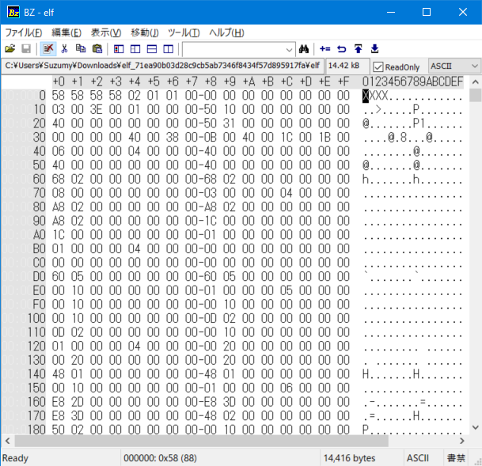

# elf
## setodaNoteCTF2021
## rev
***

問題を解凍するとelfというファイルが出てくるため、まずはこれを調べる
```
$ file elf
elf: data
```
本来ELFファイルならその情報がでるため、これはELFファイルではないと考えられるが、今回は問題文がELFで
あるため、このファイルがELFファイルと関係ないことはないと考えられる。  
だとすると、ファイルが壊れている可能性が高いため、ファイルをバイナリエディタで調べてみる。  



すると、上のように先頭の部分がXXXXとなっている。ELFファイルは本来ここが.ELF(7F 45 4C 46)となっている必要があるため、ここを修正する  

上書き保存して、この状態でもう一度fileコマンドを実行してみる。  

```
$ file elf
elf: ELF 64-bit LSB shared object, x86-64, version 1 (SYSV), dynamically linked, interpreter /lib64/ld-linux-x86-64.so.2, BuildID[sha1]=4f0f6e7df2d02645bb6387a08a099ddecb22b6f1, for GNU/Linux 3.2.0, stripped
```

このように、実行ファイルとして認識されたことが分かった。さっそく実行してみる。

```
$ ./elf
flag{run_makiba}
```

このようにフラグが表示されたため、これをsubmitする。