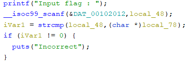
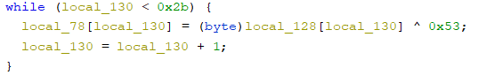

# ltrace
## waniCTF2021fall
## rev
***

配布されたzipファイルを解凍するとファイルが一つあるため、これを解析していく。
```
$ file ltrace
ltrace: ELF 64-bit LSB shared object, x86-64, version 1 (SYSV), dynamically linked, interpreter /lib64/ld-linux-x86-64.so.2, BuildID[sha1]=c1abf8babb50de267916f81f597c764c15035897, for GNU/Linux 3.2.0, not stripped
```
64ビットのELF実行ファイルっぽいため、まず実行してみる。

```
$ ./ltrace
Input flag : FLAG{maru}
Incorrect
```
正しいパスワードを見つけるとそれがフラグになってるパターンか、正しいパスワードを入力するとフラグが表示されるパターンっぽい。
ghidraにかけて調べてみる。

main関数の逆コンパイルを見る。
パスワードを比較するためstrcmpとかが使われてそうだと思い、それを探してみると、  


strcmpを見つけた。local_48とlocal_78を比較しているっぽい。
local_48はそのうえのscanfで使われているため、local_48は入力内容が入っていると考えられる。
とするとlocal_78がフラグになっていると考えられる。
ならlocal_78には何が入っているかというと



からlocal_128[local_130]と0x53でXORした結果を入れているっぽい。
つぎにlocal_128に何が入っているか調べる。
local_128で検索すると上の方に
```
  local_128[0] = 0x15;
  local_128[1] = 0x1f;
  local_128[2] = 0x12;
  local_128[3] = 0x14;
  ...
```

とあるのがわかる。
0x15はそのまま文字には変換出来ないが、0x53とXORしているため、
0x15 XOR 0x53とする。
0x15 XOR 0x53 = 0x46
0x46は文字に変換するとFとなる。最初にFが出てきたのでだいぶ怪しいが、一応もう一文字見ると
0x1f XOR 0x53 = 0x4c
0x4c = L
のため、FLと続くことが分かった。今回フラグのフォーマットはFLAG{}のため、この調子で変換していくとフラグが見つけられそうである。

以下が変換するプログラム
```
list = [0x15, 0x1f, 0x12, 0x14, 0x28, 0x30, 0x67, 0x3d, 0xc, 0x2a, 99, 
        0x26, 0xc, 100, 0x21, 0x67, 0x30, 0x60, 0xc, 0x37, 0x2a, 
        0x3d, 0x67, 0x3e, 0x62, 0x30, 0xc, 0x3f, 0x62, 0x31, 0x21, 
        0x67, 0x21, 0x2a, 0xc, 0x30, 0x67, 0x3f, 0x3f, 0x66, 0x6c, 
        0x2e, 0x53]


for i in list:
    a = i ^ 0x53
    print(chr(a), end="")
```
これを実行するとフラグでてくるためそれをsubmitする